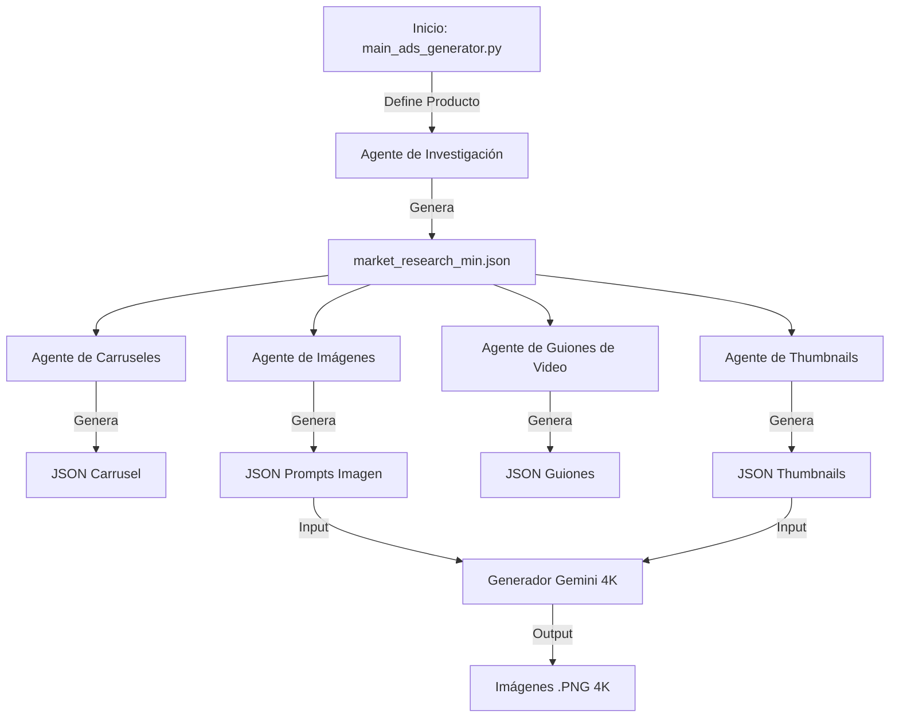

# 🚀 Wow Agent: Suite de Generación Publicitaria con IA

**Wow Agent** es un sistema orquestado de agentes inteligentes diseñado para automatizar el flujo completo de creación de anuncios de alto rendimiento. Desde la investigación de mercado hasta la generación de activos visuales y guiones, Wow Agent transforma un nombre de producto en una campaña publicitaria lista para lanzar.

---

## 🧠 Arquitectura del Sistema

El sistema funciona mediante una orquestación secuencial de agentes especializados.



---

## � Estructura del Proyecto

```text
wow_agent/
├── main_ads_generator.py       # 🎮 Orquestador Principal: Ejecuta todo el flujo.
├── check_list_generator.py     # 🔍 Solo Investigación: Genera market_research_min.json.
├── research/
│   └── market_research_agent.py # 🕵️ Agente de Investigación (GPT-5).
├── ads_generator/              # 🎨 Agentes Creativos
│   ├── nanobanana_carrusel_agent.py
│   ├── nanobanana_image_agent.py
│   ├── nanobanana_thumbnail_agent.py
│   └── video_script_agent.py
├── image_generation/           # 🖼️ Motor Visual (Google Gemini)
│   ├── test.py                 # Script de generación masiva (4K, Rate Limit).
│   └── testv2.py               # Script de prueba rápida.
├── output/                     # 📦 Resultados (Una carpeta por producto)
│   └── {nombre_producto}/
│       ├── market_research_min.json
│       ├── product_images/     # Imágenes de referencia
│       └── generated_thumbnails_gemini_4k/
├── .env                        # 🔑 Credenciales (API Keys)
└── README.md                   # 📄 Esta documentación.
```

---

## 🚀 Funcionalidades Clave

### 1. Investigación de Mercado (`research/`)
*   **Motor**: `gpt-5`.
*   **Función**: Analiza el producto, identifica dolores, deseos, ángulos de marketing y demografía objetivo.
*   **Salida**: `market_research_min.json`.

### 2. Generación de Copys y Guiones (`ads_generator/`)
*   **Carruseles**: Crea secuencias AIDA (Atención, Interés, Deseo, Acción) optimizadas.
*   **Guiones de Video**: Genera scripts virales con ganchos visuales y auditivos.
*   **Prompts de Imagen**: Diseña prompts detallados para generación de imágenes IA.

### 3. Generación Visual 4K (`image_generation/`)
*   **Motor**: Google Gemini 1.5 Pro / Flash.
*   **Características**:
    *   **Alta Resolución**: Genera imágenes nativas en 4K.
    *   **Fidelidad de Producto**: Utiliza imágenes de referencia reales para mantener la identidad del producto.
    *   **Rate Limiting**: Sistema inteligente de espera para evitar errores 429 (Quota Exceeded).
    *   **Orquestación**: Procesa automáticamente los JSONs de thumbnails generados.

---

## 🛠️ Instalación y Configuración

### Prerrequisitos
*   Python 3.10 o superior.
*   Git.

### 1. Clonar el repositorio
```bash
git clone https://github.com/tu-usuario/wow-agent.git
cd wow-agent
```

### 2. Instalar dependencias
```bash
pip install openai google-genai python-dotenv pillow
```

### 3. Configurar Variables de Entorno
Crea un archivo `.env` en la raíz del proyecto:

```env
OPENAI_API_KEY=sk-tu-api-key-de-openai
GEMINI_API_KEY=tu-api-key-de-google-gemini
```

---

## � Guía de Uso

### A. Generación Completa (Recomendado)
Para generar **toda** la campaña (investigación + textos + guiones):

1.  Abre `main_ads_generator.py`.
2.  Edita la sección de configuración del producto:
    ```python
    PRODUCT_NAME = "Nombre de tu Producto"
    PRODUCT_DESC = "Descripción detallada..."
    ```
3.  Ejecuta:
    ```bash
    python main_ads_generator.py
    ```
    *Esto creará una carpeta en `output/` con todos los archivos JSON.*

### B. Solo Investigación de Mercado
Si solo quieres analizar el producto sin generar creatividades:

1.  Edita `check_list_generator.py` con los datos del producto.
2.  Ejecuta:
    ```bash
    python check_list_generator.py
    ```

### C. Generación de Imágenes (Renderizado)
Una vez tengas los archivos JSON (generados por el paso A) y hayas puesto las fotos reales del producto en `output/{producto}/product_images/`:

1.  Abre `image_generation/test.py`.
2.  Configura el nombre del producto:
    ```python
    PRODUCT_NAME = "nombre_del_producto_slug" # Ej: bee_venom_bswell
    ```
3.  Ejecuta:
    ```bash
    python image_generation/test.py
    ```
    *El script leerá los prompts, tomará las fotos de referencia y generará las imágenes finales en 4K en la carpeta del producto.*

---

## ⚠️ Solución de Problemas Comunes

*   **Error 429 (Resource Exhausted)**: El script de imágenes (`test.py`) tiene un sistema de espera automático. Si ocurre, verás un mensaje "Waiting 30s..." y reintentará solo.
*   **Imágenes no se parecen al producto**: Asegúrate de subir buenas fotos de referencia a la carpeta `product_images/` dentro del directorio del producto.
*   **Error de API Key**: Verifica que tu archivo `.env` esté bien escrito y que las keys sean válidas.

---
**Desarrollado por Infinity Lab** 🚀
